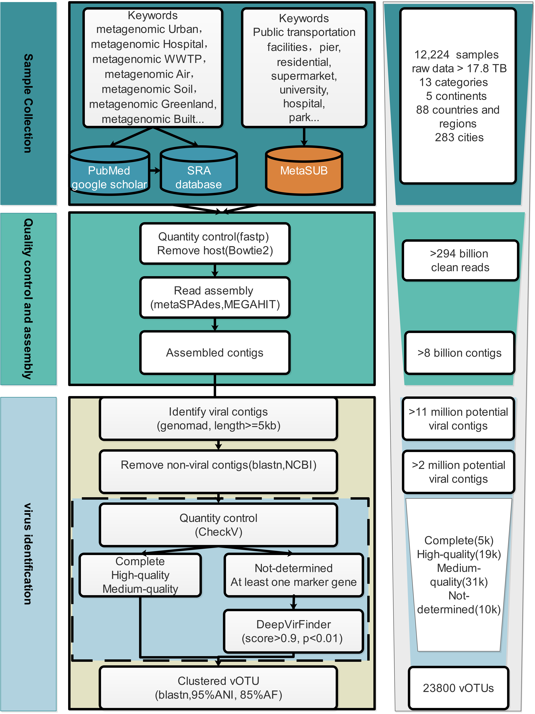

# Global Atlas of the Pan-Urban Virome (GPUV)

The **Global Atlas of the Pan-Urban Virome** was constructed from over **12,000 metagenomes** spanning **280 cities across 86 countries or regions**. Our analysis cataloged **23,800 viral species**, over **94% of which were previously uncharacterized**.  

### Workflow
Here is the workflow of GPUV:

  

### Primary Software Applications

The following is a stepwise summary of the primary tools used in the GPUV analysis:

#### **1. Quality Control**
- [fastp](https://github.com/OpenGene/fastp) and [bowtie2](https://github.com/BenLangmead/bowtie2) were used to remove low-quality reads and trim adapter sequences. Reads originating from the host (e.g., human reference genome) were filtered out.

#### **2. Assembly**
- [metaSPAdes](https://github.com/ablab/spades) and [MEGAHIT](https://github.com/voutcn/megahit) were used for metagenomic assembly.

#### **3. Viral Identification and Quality Assessment**
- [geNomad](https://portal.nersc.gov/genomad/) and [CheckV](https://bitbucket.org/berkeleylab/checkv) were used to identify viral contigs and remove sequences derived from cellular organisms or plasmids.
